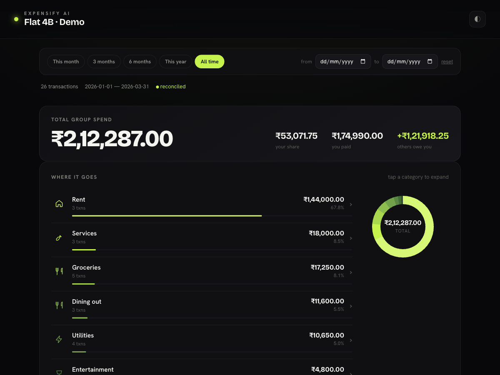
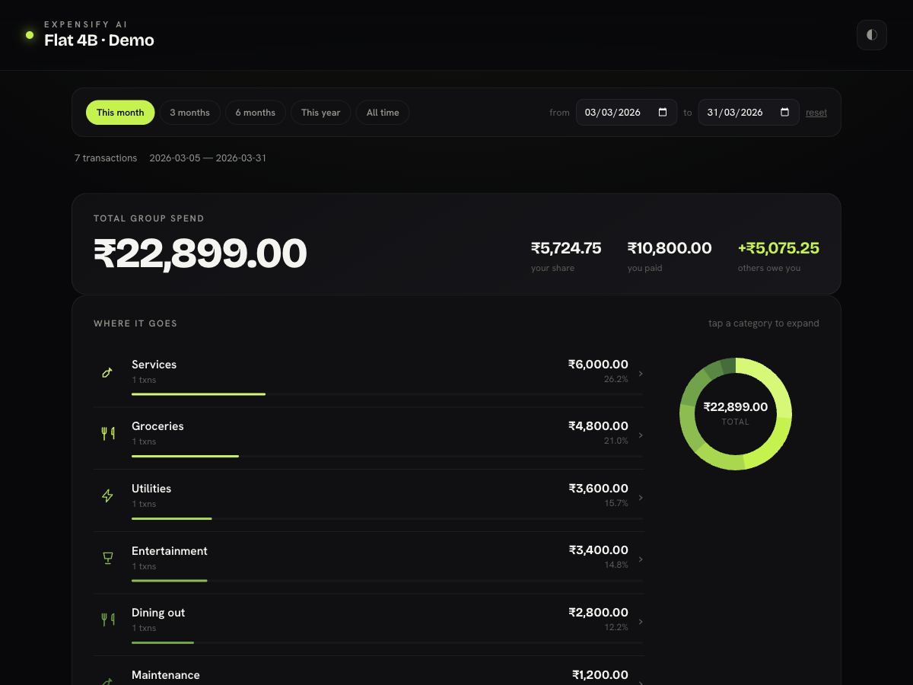

# ExpensifyAI

**Talk to your Splitwise. Get CRED-grade spending analytics.**

ExpensifyAI is a Model Context Protocol (MCP) server for [Splitwise](https://www.splitwise.com/)
that lets any LLM client (Claude, etc.) manage shared expenses **and** produce deterministic,
premium spending analytics — category breakdowns, monthly trends, per-member comparisons, and
minimum-transaction settlement plans — rendered as a self-contained, offline HTML dashboard.

> Built on top of the excellent [tarunn2799/splitwise-mcp](https://github.com/tarunn2799/splitwise-mcp);
> extended with a deterministic analytics engine and a category-first dashboard.



*Interactive dashboard, generated from synthetic data. Open `examples/demo-dashboard.html`
in a browser to try it live — pick a date range and every section recomputes instantly.*

## Analytics (what makes this ExpensifyAI)

- **Deterministic by construction** — every number is computed in pure Python with `Decimal`
  math (no float drift, no LLM estimation). Same input → byte-identical output. Each report
  carries a **reconciliation check**: per-expense shares must sum to cost, or the mismatch is flagged.
- **Category-first, à la CRED** — an expandable "where it goes" view leads every report; tap a
  category to drill into its transactions.
- **Seven analytics modules** — category breakdown · monthly trend · owed-vs-paid ("mine vs split")
  · per-member comparison + category×member matrix · transaction ledger · top transactions ·
  **settlement optimizer** (minimum transactions to settle a group — no other Splitwise tool has this).
- **Interactive dashboard** — CRED-grade dark UI with a live date-range picker + presets
  (this month / 3mo / 6mo / this year / all) that re-filter and recompute every section in the
  browser. Hand-rolled inline-SVG charts, validated colorblind-safe palette, fully offline
  (self-contained single file — no CDN, no server). All client math is integer paise, so the
  live recompute stays exact and reconciles against the Python source of truth.
- **Two analytics tools** — `analyze_spending(target_type, target_id?, dates?, generate_dashboard?)`
  and `compare_group_members(group_id, …)`. `target_type` is `me` | `group` | `friend`.

## Local mirror: delta sync + instant search

Splitwise's own search is Pro-paywalled and the API has no search endpoint. ExpensifyAI
mirrors your data into a local SQLite DB (`~/.expensifyai/splitwise.db`) and searches it offline.

- **`sync_all(full=False)`** — **delta sync**: uses the API's `updated_after` cursor so only
  expenses added/edited/moved/deleted since the last sync are fetched (first run pulls everything;
  a re-sync with no changes is a single call). Upserts by expense id, so it's idempotent. Groups
  and friends are fully refreshed each run (small). Deletes are mirrored (soft-deleted, excluded
  from search by default).
- **`search_expenses(query?, min_amount?, max_amount?, user_id?, group_id?, category?, dates?)`** —
  full-text (FTS5) over description/details/category plus structured filters, against the local DB.
  Instant, offline, covers your entire history across all groups. Beats the paywalled app search.

Each expense's full raw API object is stored (`raw` column) as the source of truth, so displayed
values stay faithful — the indexed REAL columns are only for filtering.

## Itemization, receipt scanning & default splits

Splitwise-Pro-parity, built deterministically:

- **Structured itemization** — `create_itemized_expense(description, group_id, items, …)` turns
  line-items into ONE expense where **each item can split differently** (beers ¾ to one person,
  groceries 4-way, cake between two). Each person's total `owed_share` is computed in exact
  integer paise (largest-remainder rounding, so an indivisible ₹100/3 still sums back to ₹100),
  and the expense is **reconciled to its total before anything is written** — a mismatch refuses
  to create rather than posting a wrong split. `dry_run=True` previews the computed split.
- **Receipt scanning (LLM-vision-native)** — no OCR engine, no cloud keys, no new dependencies:
  the calling agent (Claude) reads the receipt image, extracts line-items, and calls
  `create_itemized_expense`. The server owns the exact math and the Splitwise write.
- **Receipt image upload** — `attach_receipt(expense_id, image_path)` uploads a local
  image/PDF to an existing expense (multipart), so the receipt shows on it in the Splitwise
  app. Pairs with the scan flow: extract line-items from the image, then attach the image itself.
- **Save default splits** — `save_default_split(name, split)` / `list_default_splits` /
  `delete_default_split`. Reuse a template by putting `"split_ref": "roomies-4way"` on an item.
  Stored locally in `~/.expensifyai/splits.json`.

Pick any date range — the whole dashboard recomputes live in the browser:



Try it without an account:

```bash
python examples/generate_demo.py   # writes examples/demo-dashboard.html
```

## Features (MCP)

- **Full API Access**: Manage expenses, groups, friends, and comments.
- **Natural Language Resolution**: Fuzzy matching for names ("John" -> "John Smith") and groups.
- **Dual Auth**: Supports both OAuth 2.0 (recommended) and API Keys.
- **Smart Caching**: Optimizes performance for static data like categories and currencies.

## Installation

```bash
git clone https://github.com/udaysrinu/ExpensifyAI
cd ExpensifyAI
python -m venv venv
source venv/bin/activate
pip install -e .
```

## Configuration

See [SETUP.md](SETUP.md) for detailed authentication and configuration instructions.

### Quick Config
Run the included setup script:
```
python -m splitwise_mcp_server.oauth_setup
```

Use the keys provided there, and add all three to your `mcp.json`:

```json
{
  "mcpServers": {
    "splitwise": {
      "command": "python",
      "args": ["-m", "splitwise_mcp_server"],
      "env": {
        "SPLITWISE_OAUTH_ACCESS_TOKEN": "your_token_here"
      }
    }
  }
}
```

> **Get your Auth Keys**
> You can get your Consumer Key and Secret by registering an app at [https://secure.splitwise.com/apps](https://secure.splitwise.com/apps).

> **IMPORTANT:** Using a Virtual Environment?
> If you installed the package in a `venv` or Conda environment, you must use the **absolute path** to the python executable in your config.
>
> ```json
> "command": "/absolute/path/to/venv/bin/python"
> ```
> See [SETUP.md](SETUP.md#using-a-virtual-environment-venvconda) for details.

## Usage

The server enables natural language interactions with your Splitwise data.

**Examples:**
- "What's my current balance?"
- "Split a $50 dinner with Sarah."
- "Use the receipt I uploaded to split the dinner between Manav and me."
- "Show me expenses from last month."
- "Create a group called 'Ski Trip' with Mike."

## Tools

See [TOOLS.md](TOOLS.md) for detailed documentation.

### User Tools
- `get-current-user`: Get authenticated user information
- `get-user`: Get information about a specific user

### Expense Tools
- `create-expense`: Create a new expense with splits
- `get-expenses`: List expenses with optional filters
- `get-expense`: Get detailed expense information
- `update-expense`: Update an existing expense
- `delete-expense`: Delete an expense

### Group Tools
- `get-groups`: List all groups
- `get-group`: Get detailed group information
- `create-group`: Create a new group
- `delete-group`: Delete a group
- `add-user-to-group`: Add a user to a group
- `remove-user-from-group`: Remove a user from a group

### Friend Tools
- `get-friends`: List all friends
- `get-friend`: Get detailed friend information

### Resolution Tools
- `resolve-friend`: Fuzzy match friend names to user IDs
- `resolve-group`: Fuzzy match group names to group IDs
- `resolve-category`: Fuzzy match category names to category IDs

### Comment Tools
- `create-comment`: Add a comment to an expense
- `get-comments`: Get all comments for an expense
- `delete-comment`: Delete a comment

### Utility Tools
- `get-categories`: Get all expense categories
- `get-currencies`: Get all supported currencies

### Arithmetic Tools
- `add`: Add multiple numbers
- `subtract`: Subtract numbers
- `multiply`: Multiply numbers
- `divide`: Divide numbers
- `modulo`: Calculate remainder

## Development

```bash
# Setup
git clone https://github.com/udaysrinu/ExpensifyAI
cd ExpensifyAI
python -m venv venv
source venv/bin/activate
pip install -e ".[dev]"

# Test
pytest                              # full suite
pytest tests/test_analytics.py      # deterministic analytics (15 tests)

# See the dashboard with no account
python examples/generate_demo.py    # writes examples/demo-dashboard.html
```

## License

MIT License. See [LICENSE](LICENSE) for details.

Built on top of [tarunn2799/splitwise-mcp](https://github.com/tarunn2799/splitwise-mcp) (MIT);
the analytics engine, interactive dashboard, and tests are added by ExpensifyAI.
